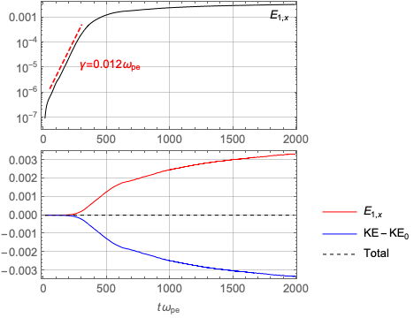
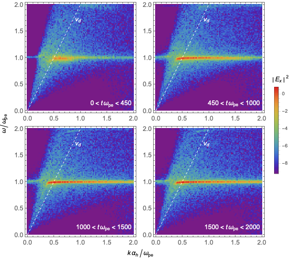
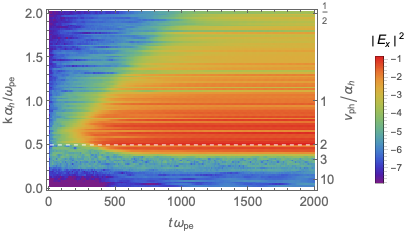
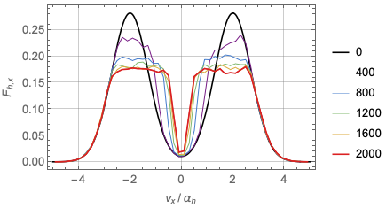

# Two-Stream Instability

This demo illustrates growing waves driven by the two-stream instability.
Here, this instability is driven by two tenuous beams of electrons drifting in opposite
directions to each other.
The counter-propagating beam is represented by `CounterBeamPlasmaDesc`
with thermal speed *α_h* = 1, shell speed *v_s* = 2 *α_h*, and
pitch angle gaussian spread *nu* = 0.42.
The combined density of two beams is 1% of the total electron density.
The other 99% electrons are assumed to be cold with no drift.

*The results and the figures are directly comparable to those of the non-relativistic case.*

## Average Energy in the System

The figure below displays the evolution of wave and electron kinetic energy densities.
The first panel shows the electric field energy curve, in a logarithmic scale.
Notice that the curve exhibits exponential growth until
*t* *ω_pe* < ~400, followed by a more gradual increase.
The estimated growth rate is γ ≈ 0.0081 *ω_pe*, consistent with the theoretical value of about 0.008 *ω_pe*.

The second panel shows a comparison of the field energy
and the kinetic energy (the departure from the initial).
Since the total of these two remains steady (dashed curve),
the wave energy must come from the electrons.

## Wave Dispersion Relation

This figure shows the power spectral densities at four different time ranges labeled in each panel.
(That is, bracket the data with the given time ranges and do the fourier transform.)
The dashed line indicates *v_s*.
At an initial stage, the wave power is strongest between 0.5 < *k* < 0.9, in agreement with a theory prediction.
Note that the wave power suddenly drops at about *k* ≈ 0.5, where according to the theory, *γ* abruptly changes its sign.
At later stages, the region of strong power extends to both the shorter and longer wave length regions.
It can be understood that the electrons that have been evolved generate new modes that were stable initially.

This is another way of looking at how waves evolve in *k* space.

## Electron Dynamics

This figure shows the evolution of the beam electrons.
As time progresses, the initial beams are flattened and the surplus electrons gradually fill the void between the two beams.
Since there are more electrons losing the speed than there are accelerating,
the total kinetic energy we saw earlier gradually decreases.
Theoretically, this change of the velocity distribution function amounts to a diffusion.

